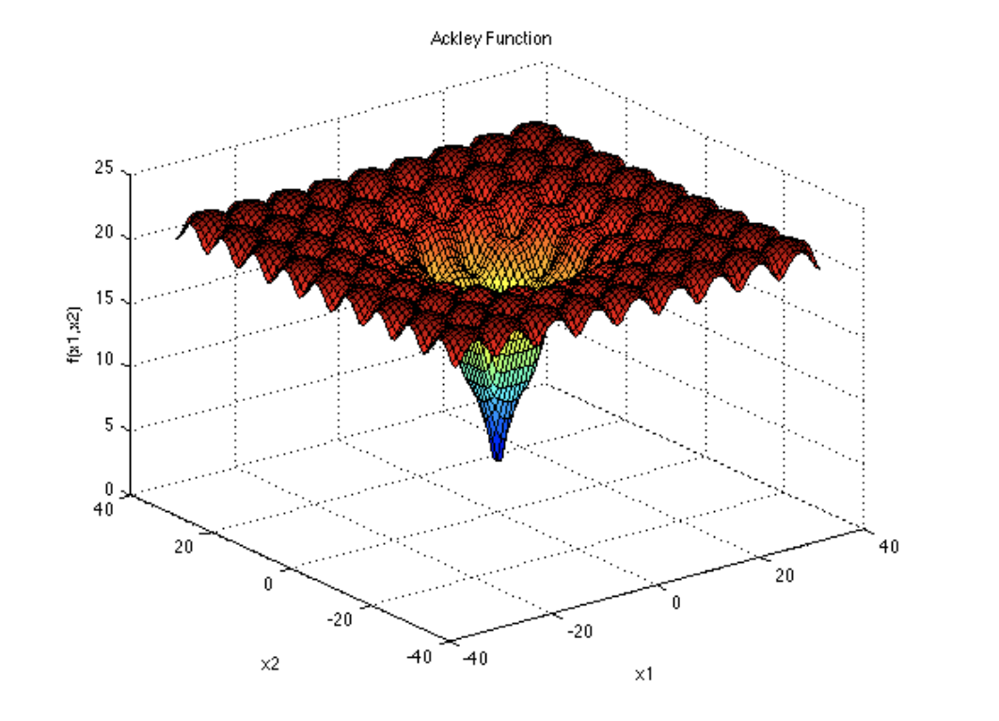

.. _verification:

.. image:: ../pics/rollo-logo.png
  :width: 450
  :alt: rollo-logo

=====================
Verification Examples
=====================
This sections contains multiple verification studies to verify ROLLO's optimization 
capabilities: commonly used evolutionary algorithm single and multiobjective 
benchmark problems and a nuclear reactor- specific problem. 

Ackley Function 
---------------
The `Ackley Function <https://www.sfu.ca/~ssurjano/ackley.html>`_ is a non-convex 
function, commonly used as a performance test for single-objective optimization 
algorithms.

:math:`f(x) = -a \cdot exp \left(-b\sqrt{\frac{1}{d}\Sigma_{i=1}^dx_i^2}\right) - exp \left(\frac{1}{d}\Sigma_{i=1}^d cos(cx_i)\right) + a + exp(1)`

The recommended variable values are a = 20, b = 0.2, and c = 2π. The Ackley function's 
global minimum point is f (0, 0) = 0. The figure below shows the resulting two-variable 
Ackley function (taken from `Ackley Function 
<https://www.sfu.ca/~ssurjano/ackley.html>`_): 

