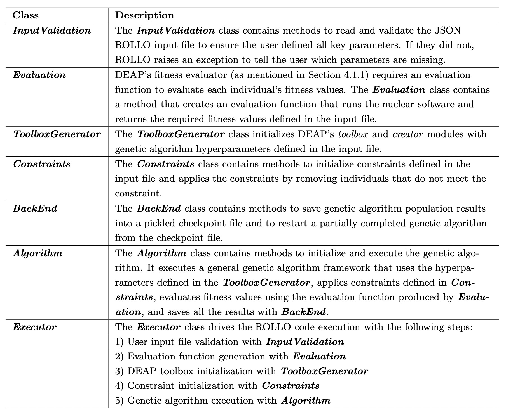

.. _theory:

.. image:: pics/rollo-logo.png
  :width: 450
  :alt: ROLLO 

======================
Theory and Methodology
======================
**ROLLO** essentially couples an evolutionary algorithm driver with nuclear 
software, such as neutron transport and thermal-hydraulics codes, to optimize 
nuclear reactor design. 

This flowchart outlines ROLLO's evolutionary algorithm optimization process and 
how the nuclear evaluation software fits in it. 

.. image:: pics/rollo-flowchart.png
  :width: 450
  :alt: ROLLO Flowchart

ROLLO: Software Architecture 
============================
This figure depicts the **ROLLO** software architecture. 
**ROLLO**'s source code is hosted on `Github 
<https://github.com/arfc/rollo/>`_.

.. image:: pics/rollo-archi.png
  :width: 600
  :alt: ROLLO Software Architecture

When the user runs a **ROLLO** input file, the `Executor` class drives ROLLO's 
execution from beginning to end. The Executor calls `InputValidation`` to parse 
the input file to ensure that the user defined all mandatory parameters and used the 
correct formatting. Next, it initializes an `Evaluation` object based on the 
``evaluators`` specifications in the input file. It uses the `Evaluation`` object to 
create a function that will run each evaluator software with the desired input 
parameters and return the output parameters calculated by the evaluator software. 
Next, it uses the `ToolboxGenerator` to create an initialized DEAP toolbox object 
based on the input file's ``algorithm`` specifications. The `ToolboxGenerator` 
object accepts the `Evaluation` object and registers it as the toolbox's 'evaluate' 
tool. Then, it initializes a `Constraints` object to contain constraints 
specified in the input file. Next, the `Executor` initializes an `Algorithm` object 
that accepts the initialized DEAP toolbox and `Constraints` object. Finally, the 
`Executor` class uses a method in the `Algorithm` object to run a general genetic 
algorithm. The `Executor` class uses the hyperparameters from the DEAP toolbox, 
applies constraints defined in the `Constraints` object, and calculates objective 
functions using the evaluation function created by the `Evaluation` object; 
all the while saving the results using the `BackEnd` class.

This table outlines the classes in the **ROLLO** software and describes each 
class' purpose. 

