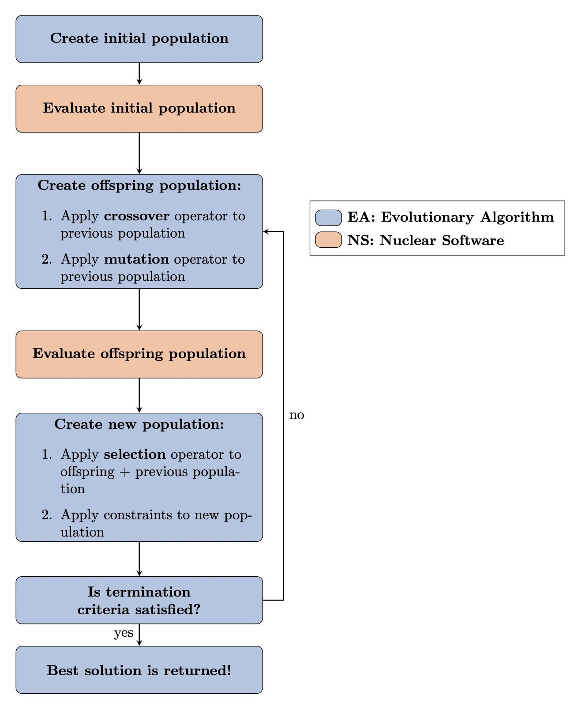
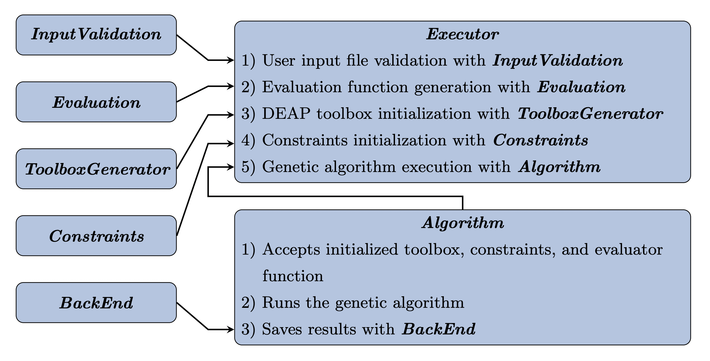

.. _theory:

.. image:: pics/rollo-logo.png
  :width: 450
  :alt: ROLLO 

======================
Theory and Methodology
======================
**ROLLO** provides a framework to couple an evolutionary algorithm driver with nuclear 
software, such as neutron transport and thermal-hydraulics codes, to optimize 
nuclear reactor design. 
**ROLLO** uses the `DEAP <https://deap.readthedocs.io/en/master/>`_ python package 
to drive the evolutionary algorithm optimization process. 
**ROLLO** is nuclear code-agnostic and does not have dependencies on any nuclear 
software.

This flowchart outlines **ROLLO**'s evolutionary algorithm optimization process and 
how the nuclear evaluation software fits in it. 

ROLLO: Software Architecture 
============================
This figure depicts the **ROLLO** software architecture. 
**ROLLO**'s source code is hosted on `Github 
<https://github.com/arfc/rollo/>`_.

When the user runs a **ROLLO** input file, the `Executor` class drives **ROLLO**'s 
execution from beginning to end. The Executor calls `InputValidation` to parse 
the input file to ensure that the user defined all mandatory parameters and used the 
correct formatting. Next, it initializes an `Evaluation` object based on the 
``evaluators`` specifications in the input file. It uses the `Evaluation` object to 
create a function that will run each evaluator software with the desired input 
parameters and return the output parameters calculated by the evaluator software. 
Next, it uses the `ToolboxGenerator` to create an initialized DEAP toolbox object 
based on the input file's ``algorithm`` specifications. The `ToolboxGenerator` 
object accepts the `Evaluation` object and registers it as the toolbox's `evaluate`
tool. Then, it initializes a `Constraints` object to contain constraints 
specified in the input file. Next, the `Executor` initializes an `Algorithm` object 
that accepts the initialized DEAP toolbox and `Constraints` object. Finally, the 
`Executor` class uses a method in the `Algorithm` object to run a general genetic 
algorithm. The `Executor` class uses the hyperparameters from the DEAP toolbox, 
applies constraints defined in the `Constraints` object, and calculates objective 
functions using the evaluation function created by the `Evaluation` object; 
all the while saving the results using the `BackEnd` class.

This table outlines the classes in the **ROLLO** software and describes each 
class' purpose. 

.. list-table::
   :widths: 20 80
   :header-rows: 1

   * - Class
     - Description
   * - `InputValidation`
     - The `InputValidation` class contains methods to read and validate the JSON 
       **ROLLO** input file to ensure the user defined all key parameters. If they did 
       not, **ROLLO** raises an exception to tell the user which parameters are missing.
   * - `Evaluation`
     - DEAP's fitness evaluator (as mentioned in Section 4.1.1) requires an evaluation 
       function to evaluate each individual's fitness values. The `Evaluation` class 
       contains a method that creates an evaluation function that runs the nuclear 
       software and returns the required fitness values defined in the input file.
   * - `ToolboxGenerator`
     - The `ToolboxGenerator` class initializes DEAP's toolbox and creator modules 
       with genetic algorithm hyperparameters defined in the input file.
   * - `Constraints`
     - The `Constraints` class contains methods to initialize constraints defined in 
       the input file and applies the constraints by removing individuals that do not 
       meet the constraint.
   * - `BackEnd`
     - The `BackEnd` class contains methods to save genetic algorithm population 
       results into a pickled checkpoint file and to restart a partially completed 
       genetic algorithm from the checkpoint file.
   * - `Algorithm`
     - The `Algorithm` class contains methods to initialize and execute the genetic 
       algorithm. It executes a general genetic algorithm framework that uses the 
       hyperparameters defined in the `ToolboxGenerator`, applies constraints defined 
       in `Constraints`, evaluates fitness values using the evaluation function 
       produced by `Evaluation`, and saves all the results with `BackEnd`.
   * - `Executor`
     - The Executor class drives the **ROLLO** code execution with the following steps:
       1) User input file validation with InputValidation, 
       2) Evaluation function generation with Evaluation, 
       3) DEAP toolbox initialization with ToolboxGenerator,
       4) Constraint initialization with Constraints, 
       5) Genetic algorithm execution with Algorithm